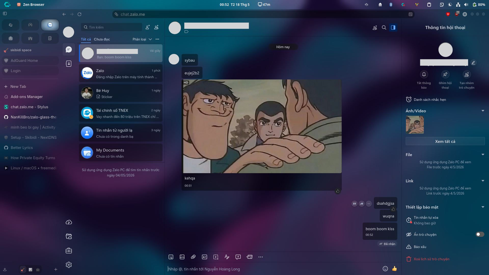

# Zalo Glass Theme

A sleek, transparent glass-like theme for Zalo Web.

## Requirements

To use this theme and achieve the intended transparent effect, you will need the following:

1. **[Zen Browser](https://zen-browser.app/)**: This theme is designed to be used with Zen Browser.
2. **Browser Transparency**: To make the browser window itself transparent, please install and follow the instructions from [Zen-Nebula](https://github.com/JustAdumbPrsn/Zen-Nebula).
3. **CSS Injector**: You must have a CSS injector extension installed (such as **Stylus**).

## Installation

1. Install a CSS injector extension like Stylus.
2. Configure the extension to apply styles to Zalo Web.
3. Copy the CSS code from `theme.css` in this repository and paste it into your CSS injector.
4. Save the style. Ensure Zen Browser is configured for transparency using the Zen-Nebula guide!
